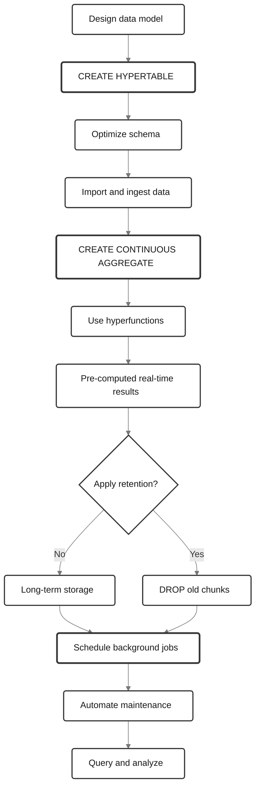

```mermaid
%%{init: {
  'theme':'base',
  'themeVariables': {
    'primaryColor':'#fff',
    'primaryTextColor':'#1a1a1a',
    'primaryBorderColor':'#333',
    'lineColor':'#666',
    'secondaryColor':'#fff',
    'secondaryTextColor':'#1a1a1a',
    'secondaryBorderColor':'#333',
    'tertiaryColor':'#fff',
    'tertiaryTextColor':'#1a1a1a',
    'tertiaryBorderColor':'#333',
    'noteBkgColor':'#fff',
    'noteTextColor':'#1a1a1a',
    'noteBorderColor':'#333',
    'background':'#fff',
    'mainBkg':'#fff',
    'fontFamily': "'Geist Mono', monospace",
    'edgeLabelBackground':'#fff',
    'labelColor':'#333',
    'labelTextColor':'#333'
  },
  'flowchart': { 'padding': 30, 'htmlLabels': true, 'curve': 'stepAfter' },
  'themeCSS': `
    .node rect:hover,
    .node polygon:hover,
    .node path:hover {
      fill: rgba(244, 255, 97, 0.18) !important;
      transition: fill 120ms ease-in-out;
    }
  `
}}%%
graph TB
    Start[Design data model&nbsp;&nbsp;] --> Hypertable[CREATE HYPERTABLE&nbsp;&nbsp;]
    Hypertable --> OptimizeSchema[Optimize schema&nbsp;&nbsp;]
    OptimizeSchema --> Import[Import and ingest data&nbsp;&nbsp;]

    Import --> ContinuousAggs[CREATE CONTINUOUS AGGREGATE&nbsp;&nbsp;]
    ContinuousAggs --> Hyperfunctions[Use hyperfunctions&nbsp;&nbsp;]
    Hyperfunctions --> AggResults[Pre-computed real-time results&nbsp;&nbsp;]

    AggResults --> Retention{Apply retention?&nbsp;&nbsp;}
    Retention -->|Yes| DropData[DROP old chunks&nbsp;&nbsp;]
    Retention -->|No| Archive

    Archive[Long-term storage&nbsp;&nbsp;] --> Jobs[Schedule background jobs&nbsp;&nbsp;]
    DropData --> Jobs

    Jobs --> Automate[Automate maintenance&nbsp;&nbsp;]
    Automate --> Query[Query and analyze&nbsp;&nbsp;]

    style Hypertable fill:#fff,stroke:#333,stroke-width:3px,color:#1a1a1a,rx:4,ry:4
    style ContinuousAggs fill:#fff,stroke:#333,stroke-width:3px,color:#1a1a1a,rx:4,ry:4
    style Jobs fill:#fff,stroke:#333,stroke-width:3px,color:#1a1a1a,rx:4,ry:4

    style Start fill:#fff,stroke:#333,stroke-width:2px,color:#1a1a1a,rx:4,ry:4
    style OptimizeSchema fill:#fff,stroke:#333,stroke-width:2px,color:#1a1a1a,rx:4,ry:4
    style Import fill:#fff,stroke:#333,stroke-width:2px,color:#1a1a1a,rx:4,ry:4
    style Hyperfunctions fill:#fff,stroke:#333,stroke-width:2px,color:#1a1a1a,rx:4,ry:4
    style AggResults fill:#fff,stroke:#333,stroke-width:2px,color:#1a1a1a,rx:4,ry:4
    style DropData fill:#fff,stroke:#333,stroke-width:2px,color:#1a1a1a,rx:4,ry:4
    style Archive fill:#fff,stroke:#333,stroke-width:2px,color:#1a1a1a,rx:4,ry:4
    style Automate fill:#fff,stroke:#333,stroke-width:2px,color:#1a1a1a,rx:4,ry:4
    style Query fill:#fff,stroke:#333,stroke-width:2px,color:#1a1a1a,rx:4,ry:4

    style Retention fill:#fff,stroke:#333,stroke-width:2px,color:#1a1a1a

    linkStyle default stroke:#777,stroke-width:1px

    click Start "/manage-data/understand/design-your-data-model" "Design your data model"
    click Hypertable "/manage-data/capabilities/hypertables/setup-hypertables" "Hypertables documentation"
    click OptimizeSchema "/manage-data/capabilities/optimize-your-schema/understand-database-schemas" "Schema optimization documentation"
    click Import "/manage-data/import-and-ingest/import-terminal" "Import and ingest documentation"
    click ContinuousAggs "/manage-data/capabilities/continuous-aggregates/setup-continuous-aggregates" "Continuous aggregates documentation"
    click Hyperfunctions "/manage-data/capabilities/hyperfunctions/understand-hyperfunctions" "Hyperfunctions documentation"
    click Jobs "/manage-data/capabilities/create-and-manage-jobs" "Jobs documentation"
    click DropData "/manage-data/capabilities/data-retention" "Data retention documentation"
```
