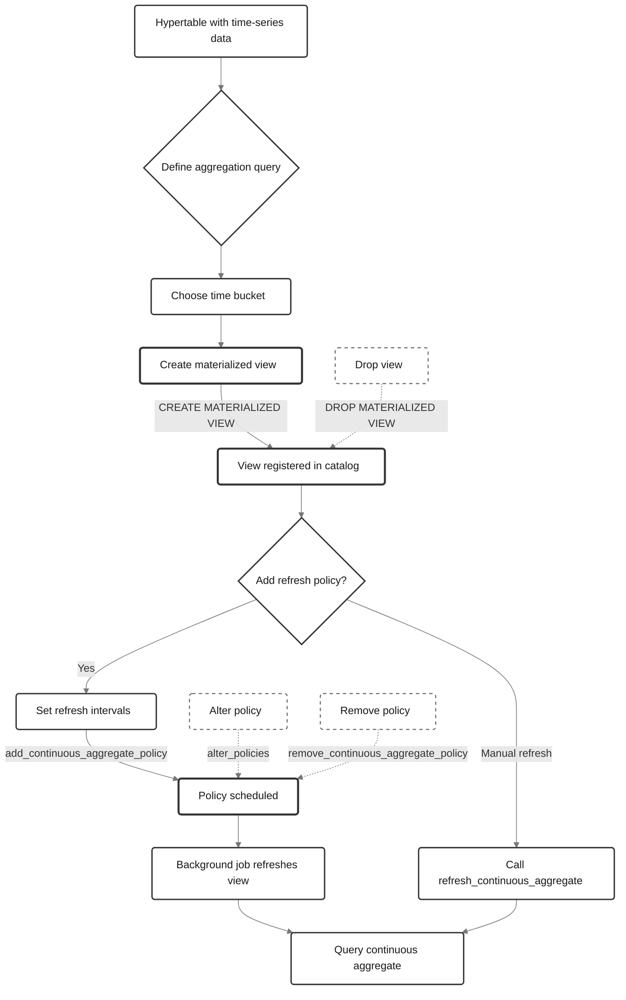

```mermaid
%%{init: {
  'theme':'base',
  'themeVariables': {
    'primaryColor':'#fff',
    'primaryTextColor':'#1a1a1a',
    'primaryBorderColor':'#333',
    'lineColor':'#666',
    'secondaryColor':'#fff',
    'secondaryTextColor':'#1a1a1a',
    'secondaryBorderColor':'#333',
    'tertiaryColor':'#fff',
    'tertiaryTextColor':'#1a1a1a',
    'tertiaryBorderColor':'#333',
    'noteBkgColor':'#fff',
    'noteTextColor':'#1a1a1a',
    'noteBorderColor':'#333',
    'background':'#fff',
    'mainBkg':'#fff',
    'fontFamily': "'Geist Mono', monospace",
    'edgeLabelBackground':'#fff',
    'labelColor':'#333',
    'labelTextColor':'#333'
  },
  'flowchart': { 'padding': 30, 'htmlLabels': true, 'curve': 'stepAfter' },

  /* Hover tint (best-effort; renderer may ignore themeCSS) */
  'themeCSS': `
    .node rect:hover,
    .node polygon:hover,
    .node path:hover {
      fill: rgba(244, 255, 97, 0.18) !important;
      transition: fill 120ms ease-in-out;
    }
  `
}}%%
graph TB
    A[Hypertable with time-series data] --> B{Define aggregation query}
    B --> C[Choose time bucket&nbsp;&nbsp;]
    C --> D[Create materialized view&nbsp;&nbsp;]

    D -->|CREATE MATERIALIZED VIEW| E[View registered in catalog&nbsp;&nbsp;]
    E --> F{Add refresh policy?}

    F -->|Yes| G[Set refresh intervals&nbsp;&nbsp;]
    G -->|add_continuous_aggregate_policy| H[Policy scheduled]
    H --> I[Background job refreshes view]
    I --> J[Query continuous aggregate]

    F -->|Manual refresh| K[Call refresh_continuous_aggregate&nbsp;&nbsp;&nbsp;&nbsp;]
    K --> J

    L[Alter policy&nbsp;&nbsp;] -.->|alter_policies| H
    M[Remove policy&nbsp;&nbsp;] -.->|remove_continuous_aggregate_policy| H
    N[Drop view&nbsp;&nbsp;] -.->|DROP MATERIALIZED VIEW| E

    %% Border-only hierarchy
    %% - Primary nodes: thicker border (D, E, H)
    %% - Standard nodes: normal border (A, B, C, F, G, I, J, K)
    %% - Optional nodes: dashed + lighter border (L, M, N)

    style A fill:#fff,stroke:#333,stroke-width:2px,color:#1a1a1a,rx:4,ry:4
    style B fill:#fff,stroke:#333,stroke-width:2px,color:#1a1a1a
    style C fill:#fff,stroke:#333,stroke-width:2px,color:#1a1a1a,rx:4,ry:4

    style D fill:#fff,stroke:#333,stroke-width:3px,color:#1a1a1a,rx:4,ry:4
    style E fill:#fff,stroke:#333,stroke-width:3px,color:#1a1a1a,rx:4,ry:4
    style H fill:#fff,stroke:#333,stroke-width:3px,color:#1a1a1a,rx:4,ry:4

    style F fill:#fff,stroke:#333,stroke-width:2px,color:#1a1a1a
    style G fill:#fff,stroke:#333,stroke-width:2px,color:#1a1a1a,rx:4,ry:4
    style I fill:#fff,stroke:#333,stroke-width:2px,color:#1a1a1a,rx:4,ry:4
    style J fill:#fff,stroke:#333,stroke-width:2px,color:#1a1a1a,rx:4,ry:4
    style K fill:#fff,stroke:#333,stroke-width:2px,color:#1a1a1a,rx:4,ry:4

    style L fill:#fff,stroke:#666,stroke-width:1.5px,stroke-dasharray: 5 5,color:#1a1a1a,rx:4,ry:4
    style M fill:#fff,stroke:#666,stroke-width:1.5px,stroke-dasharray: 5 5,color:#1a1a1a,rx:4,ry:4
    style N fill:#fff,stroke:#666,stroke-width:1.5px,stroke-dasharray: 5 5,color:#1a1a1a,rx:4,ry:4

    %% connectors
    linkStyle default stroke:#777,stroke-width:1px

    click D "/api-reference/timescaledb/continuous-aggregates/create_materialized_view" "CREATE MATERIALIZED VIEW API reference"
    click E "/api-reference/timescaledb/informational-views/index" "Learn about the catalog"
    click G "/api-reference/timescaledb/continuous-aggregates/add_continuous_aggregate_policy" "add_continuous_aggregate_policy API reference"
    click K "/api-reference/timescaledb/continuous-aggregates/refresh_continuous_aggregate" "refresh_continuous_aggregate API reference"
    click L "/api-reference/timescaledb/continuous-aggregates/alter_policies" "alter_policies API reference"
    click M "/api-reference/timescaledb/continuous-aggregates/remove_continuous_aggregate_policy" "remove_continuous_aggregate_policy API reference"
```
