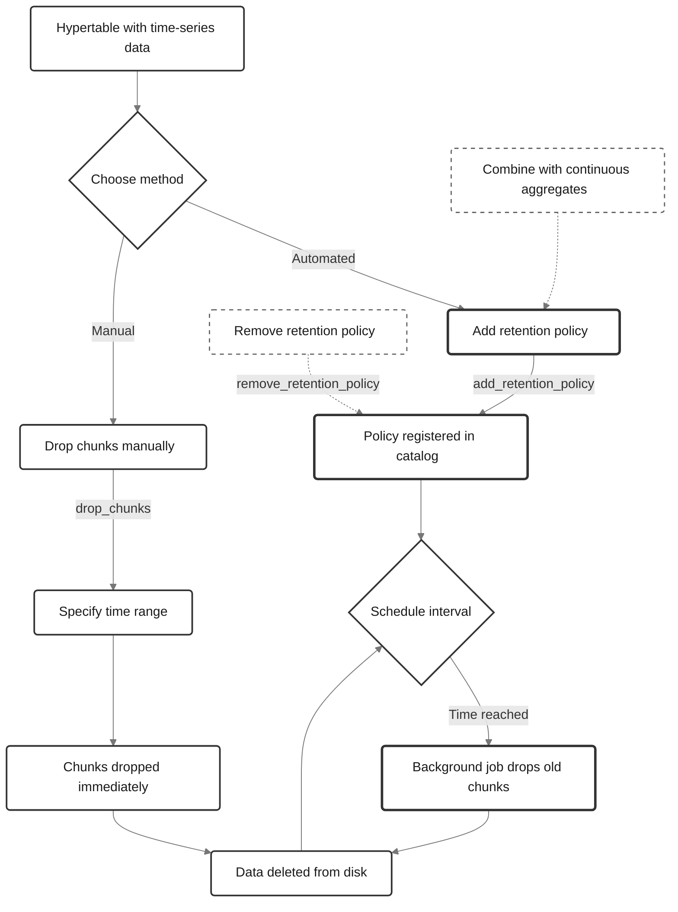

```mermaid
%%{init: {
  'theme':'base',
  'themeVariables': {
    'primaryColor':'#fff',
    'primaryTextColor':'#1a1a1a',
    'primaryBorderColor':'#333',
    'lineColor':'#666',
    'secondaryColor':'#fff',
    'secondaryTextColor':'#1a1a1a',
    'secondaryBorderColor':'#333',
    'tertiaryColor':'#fff',
    'tertiaryTextColor':'#1a1a1a',
    'tertiaryBorderColor':'#333',
    'noteBkgColor':'#fff',
    'noteTextColor':'#1a1a1a',
    'noteBorderColor':'#333',
    'background':'#fff',
    'mainBkg':'#fff',
    'fontFamily': "'Geist Mono', monospace",
    'edgeLabelBackground':'#fff',
    'labelColor':'#333',
    'labelTextColor':'#333'
  },
  'flowchart': { 'padding': 30, 'htmlLabels': true, 'curve': 'stepAfter' },

  /* Hover tint (best-effort; renderer may ignore themeCSS) */
  'themeCSS': `
    .node rect:hover,
    .node polygon:hover,
    .node path:hover {
      fill: rgba(244, 255, 97, 0.18) !important;
      transition: fill 120ms ease-in-out;
    }
  `
}}%%
graph TB
    A[Hypertable with time-series data] --> B{Choose method}
    B -->|Automated| C[Add retention policy&nbsp;&nbsp;]
    B -->|Manual| D[Drop chunks manually&nbsp;&nbsp;]

    C -->|add_retention_policy| E[Policy registered in catalog&nbsp;&nbsp;]
    E --> F{Schedule interval}
    F -->|Time reached| G[Background job drops old chunks]
    G --> H[Data deleted from disk]
    H --> F

    D -->|drop_chunks| I[Specify time range]
    I --> J[Chunks dropped immediately]
    J --> H

    K[Remove retention policy&nbsp;&nbsp;] -.->|remove_retention_policy| E
    L[Combine with continuous aggregates&nbsp;&nbsp;] -.-> C

    %% Border-only hierarchy
    %% - Primary nodes: thicker border (C, E, G)
    %% - Standard nodes: normal border (A, B, D, F, H, I, J)
    %% - Optional nodes: dashed + lighter border (K, L)

    style A fill:#fff,stroke:#333,stroke-width:2px,color:#1a1a1a,rx:4,ry:4
    style B fill:#fff,stroke:#333,stroke-width:2px,color:#1a1a1a

    style C fill:#fff,stroke:#333,stroke-width:3px,color:#1a1a1a,rx:4,ry:4
    style E fill:#fff,stroke:#333,stroke-width:3px,color:#1a1a1a,rx:4,ry:4
    style G fill:#fff,stroke:#333,stroke-width:3px,color:#1a1a1a,rx:4,ry:4

    style D fill:#fff,stroke:#333,stroke-width:2px,color:#1a1a1a,rx:4,ry:4
    style F fill:#fff,stroke:#333,stroke-width:2px,color:#1a1a1a
    style H fill:#fff,stroke:#333,stroke-width:2px,color:#1a1a1a,rx:4,ry:4
    style I fill:#fff,stroke:#333,stroke-width:2px,color:#1a1a1a,rx:4,ry:4
    style J fill:#fff,stroke:#333,stroke-width:2px,color:#1a1a1a,rx:4,ry:4

    style K fill:#fff,stroke:#666,stroke-width:1.5px,stroke-dasharray: 5 5,color:#1a1a1a,rx:4,ry:4
    style L fill:#fff,stroke:#666,stroke-width:1.5px,stroke-dasharray: 5 5,color:#1a1a1a,rx:4,ry:4

    %% connectors
    linkStyle default stroke:#777,stroke-width:1px

    click C "/api-reference/timescaledb/data-retention/add_retention_policy" "add_retention_policy API reference"
    click D "/api-reference/timescaledb/hypertables/drop_chunks" "drop_chunks API reference"
    click E "/api-reference/timescaledb/informational-views/index" "Learn about the catalog"
    click K "/api-reference/timescaledb/data-retention/remove_retention_policy" "remove_retention_policy API reference"
```