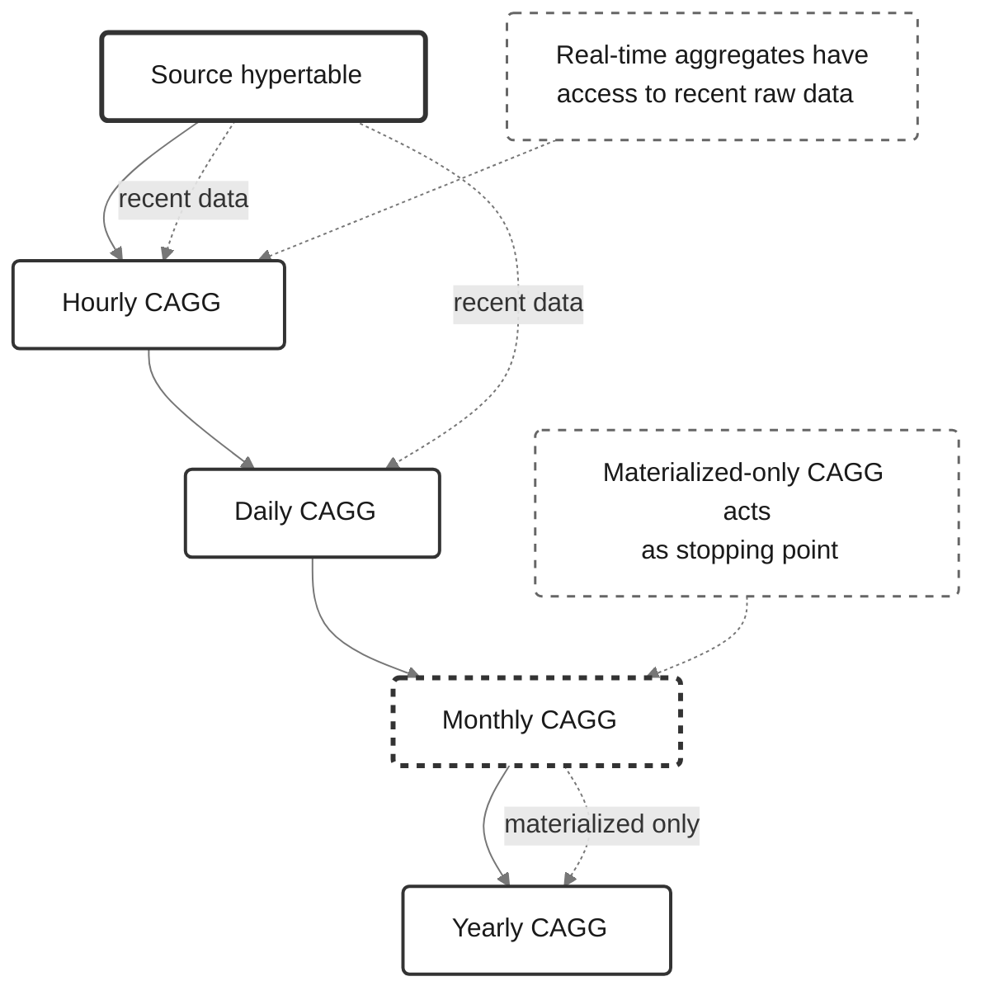

```mermaid
%%{init: {
  'theme':'base',
  'themeVariables': {
    'primaryColor':'#fff',
    'primaryTextColor':'#1a1a1a',
    'primaryBorderColor':'#333',
    'lineColor':'#666',
    'secondaryColor':'#fff',
    'secondaryTextColor':'#1a1a1a',
    'secondaryBorderColor':'#333',
    'tertiaryColor':'#fff',
    'tertiaryTextColor':'#1a1a1a',
    'tertiaryBorderColor':'#333',
    'noteBkgColor':'#fff',
    'noteTextColor':'#1a1a1a',
    'noteBorderColor':'#333',
    'background':'#fff',
    'mainBkg':'#fff',
    'fontFamily': "'Geist Mono', monospace",
    'edgeLabelBackground':'#fff',
    'labelColor':'#333',
    'labelTextColor':'#333'
  },
  'flowchart': { 'padding': 30, 'htmlLabels': true, 'curve': 'stepAfter' },

  /* Hover tint (best-effort; renderer may ignore themeCSS) */
  'themeCSS': `
    .node rect:hover,
    .node polygon:hover,
    .node path:hover {
      fill: rgba(244, 255, 97, 0.18) !important;
      transition: fill 120ms ease-in-out;
    }
  `
}}%%
graph TB
    A[Source hypertable&nbsp;&nbsp;] --> B[Hourly CAGG&nbsp;&nbsp;]
    B --> C[Daily CAGG&nbsp;&nbsp;]
    C --> D[Monthly CAGG&nbsp;&nbsp;]
    D --> E[Yearly CAGG&nbsp;&nbsp;]

    A -.->|recent data| B
    A -.->|recent data| C
    D -.->|materialized only| E

    F[Real-time aggregates have<br/>access to recent raw data&nbsp;&nbsp;] -.-> B
    G[Materialized-only CAGG acts<br/>as stopping point&nbsp;&nbsp;] -.-> D

    %% Border-only hierarchy
    %% - Source hypertable: thicker border (A)
    %% - Real-time CAGGs: normal border (B, C, E)
    %% - Materialized-only CAGG: thicker dashed border (D)
    %% - Notes: lighter dashed border (F, G)

    style A fill:#fff,stroke:#333,stroke-width:3px,color:#1a1a1a,rx:4,ry:4
    style B fill:#fff,stroke:#333,stroke-width:2px,color:#1a1a1a,rx:4,ry:4
    style C fill:#fff,stroke:#333,stroke-width:2px,color:#1a1a1a,rx:4,ry:4
    style D fill:#fff,stroke:#333,stroke-width:3px,stroke-dasharray: 5 5,color:#1a1a1a,rx:4,ry:4
    style E fill:#fff,stroke:#333,stroke-width:2px,color:#1a1a1a,rx:4,ry:4

    style F fill:#fff,stroke:#666,stroke-width:1.5px,stroke-dasharray: 5 5,color:#1a1a1a,rx:4,ry:4
    style G fill:#fff,stroke:#666,stroke-width:1.5px,stroke-dasharray: 5 5,color:#1a1a1a,rx:4,ry:4

    %% connectors
    linkStyle default stroke:#777,stroke-width:1px

    click B "/manage-data/capabilities/continuous-aggregates/real-time-aggregates" "Learn about real-time aggregates"
    click D "/manage-data/capabilities/continuous-aggregates/real-time-aggregates" "Learn about real-time aggregates"
```
