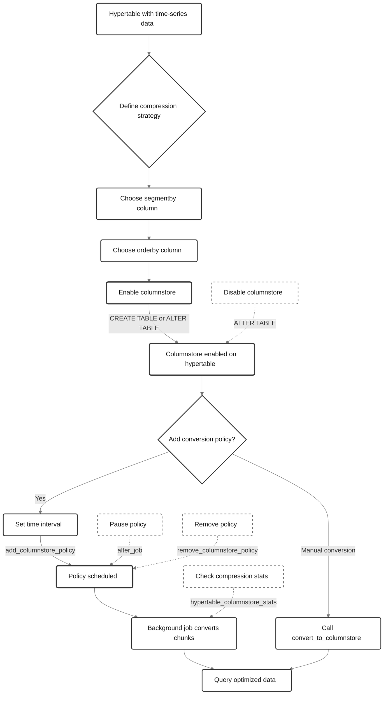

```mermaid
%%{init: {
  'theme':'base',
  'themeVariables': {
    'primaryColor':'#fff',
    'primaryTextColor':'#1a1a1a',
    'primaryBorderColor':'#333',
    'lineColor':'#666',
    'secondaryColor':'#fff',
    'secondaryTextColor':'#1a1a1a',
    'secondaryBorderColor':'#333',
    'tertiaryColor':'#fff',
    'tertiaryTextColor':'#1a1a1a',
    'tertiaryBorderColor':'#333',
    'noteBkgColor':'#fff',
    'noteTextColor':'#1a1a1a',
    'noteBorderColor':'#333',
    'background':'#fff',
    'mainBkg':'#fff',
    'fontFamily': "'Geist Mono', monospace",
    'edgeLabelBackground':'#fff',
    'labelColor':'#333',
    'labelTextColor':'#333'
  },
  'flowchart': { 'padding': 30, 'htmlLabels': true, 'curve': 'stepAfter' },

  /* Hover tint (best-effort; renderer may ignore themeCSS) */
  'themeCSS': `
    .node rect:hover,
    .node polygon:hover,
    .node path:hover {
      fill: rgba(244, 255, 97, 0.18) !important;
      transition: fill 120ms ease-in-out;
    }
  `
}}%%
graph TB
    A[Hypertable with time-series data&nbsp;&nbsp;] --> B{Define compression strategy}
    B --> C[Choose segmentby column&nbsp;&nbsp;]
    C --> D[Choose orderby column&nbsp;&nbsp;]
    D --> E[Enable columnstore&nbsp;&nbsp;]

    E -->|CREATE TABLE or ALTER TABLE| F[Columnstore enabled on hypertable&nbsp;&nbsp;]
    F --> G{Add conversion policy?}

    G -->|Yes| H[Set time interval&nbsp;&nbsp;]
    H -->|add_columnstore_policy| I[Policy scheduled&nbsp;&nbsp;]
    I --> J[Background job converts chunks]
    J --> K[Query optimized data&nbsp;&nbsp;]

    G -->|Manual conversion| L[Call convert_to_columnstore&nbsp;&nbsp;]
    L --> K

    M[Check compression stats&nbsp;&nbsp;] -.->|hypertable_columnstore_stats| J
    N[Pause policy&nbsp;&nbsp;] -.->|alter_job| I
    O[Remove policy&nbsp;&nbsp;] -.->|remove_columnstore_policy| I
    P[Disable columnstore&nbsp;&nbsp;] -.->|ALTER TABLE| F

    %% Border-only hierarchy
    %% - Primary nodes: thicker border (E, F, I)
    %% - Standard nodes: normal border (A, B, C, D, G, H, J, K, L)
    %% - Optional nodes: dashed + lighter border (M, N, O, P)

    style A fill:#fff,stroke:#333,stroke-width:2px,color:#1a1a1a,rx:4,ry:4
    style B fill:#fff,stroke:#333,stroke-width:2px,color:#1a1a1a
    style C fill:#fff,stroke:#333,stroke-width:2px,color:#1a1a1a,rx:4,ry:4
    style D fill:#fff,stroke:#333,stroke-width:2px,color:#1a1a1a,rx:4,ry:4

    style E fill:#fff,stroke:#333,stroke-width:3px,color:#1a1a1a,rx:4,ry:4
    style F fill:#fff,stroke:#333,stroke-width:3px,color:#1a1a1a,rx:4,ry:4
    style I fill:#fff,stroke:#333,stroke-width:3px,color:#1a1a1a,rx:4,ry:4

    style G fill:#fff,stroke:#333,stroke-width:2px,color:#1a1a1a
    style H fill:#fff,stroke:#333,stroke-width:2px,color:#1a1a1a,rx:4,ry:4
    style J fill:#fff,stroke:#333,stroke-width:2px,color:#1a1a1a,rx:4,ry:4
    style K fill:#fff,stroke:#333,stroke-width:2px,color:#1a1a1a,rx:4,ry:4
    style L fill:#fff,stroke:#333,stroke-width:2px,color:#1a1a1a,rx:4,ry:4

    style M fill:#fff,stroke:#666,stroke-width:1.5px,stroke-dasharray: 5 5,color:#1a1a1a,rx:4,ry:4
    style N fill:#fff,stroke:#666,stroke-width:1.5px,stroke-dasharray: 5 5,color:#1a1a1a,rx:4,ry:4
    style O fill:#fff,stroke:#666,stroke-width:1.5px,stroke-dasharray: 5 5,color:#1a1a1a,rx:4,ry:4
    style P fill:#fff,stroke:#666,stroke-width:1.5px,stroke-dasharray: 5 5,color:#1a1a1a,rx:4,ry:4

    %% connectors
    linkStyle default stroke:#777,stroke-width:1px

    click E "/api-reference/timescaledb/hypertables/create_table" "CREATE TABLE API reference"
    click F "/manage-data/capabilities/hypercore/understand-hypercore" "Learn about hypercore"
    click H "/api-reference/timescaledb/hypercore/add_columnstore_policy" "add_columnstore_policy API reference"
    click L "/api-reference/timescaledb/hypercore/convert_to_columnstore" "convert_to_columnstore API reference"
    click M "/api-reference/timescaledb/informational-views/hypertable_columnstore_stats" "hypertable_columnstore_stats API reference"
    click N "/api-reference/timescaledb/jobs/alter_job" "alter_job API reference"
    click O "/api-reference/timescaledb/hypercore/remove_columnstore_policy" "remove_columnstore_policy API reference"
```