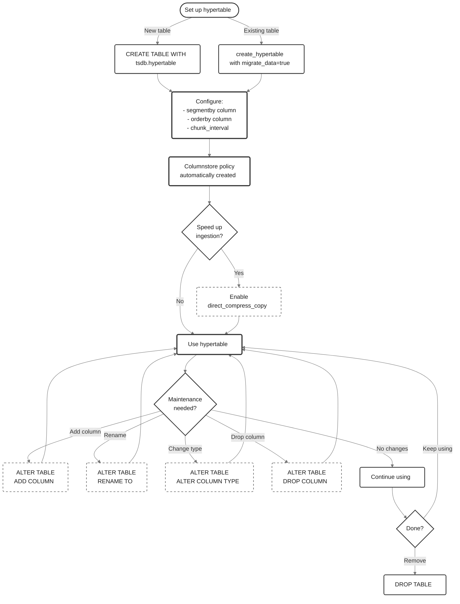

```mermaid
%%{init: {
  'theme':'base',
  'themeVariables': {
    'primaryColor':'#F4FF61',
    'primaryTextColor':'#1a1a1a',
    'primaryBorderColor':'#333',
    'lineColor':'#777',
    'secondaryColor':'#6D5AFF',
    'secondaryTextColor':'#fff',
    'secondaryBorderColor':'#333',
    'tertiaryColor':'#4A90E2',
    'tertiaryTextColor':'#fff',
    'tertiaryBorderColor':'#333',
    'noteBkgColor':'#F4FF61',
    'noteTextColor':'#1a1a1a',
    'noteBorderColor':'#333',
    'background':'#fff',
    'mainBkg':'#fff',
    'fontFamily': "'Geist Mono', monospace",
    'edgeLabelBackground':'#fff',
    'labelColor':'#333',
    'labelTextColor':'#333'
  },
  'flowchart': {
    'padding': 30,
    'htmlLabels': true,
    'curve': 'stepAfter'
  }
}}%%
flowchart TD
    Start([Set up hypertable&nbsp;&nbsp;]) -->|New table| CreateNew[CREATE TABLE WITH&nbsp;&nbsp;<br/>tsdb.hypertable&nbsp;&nbsp;]
    Start -->|Existing table| Convert[create_hypertable&nbsp;&nbsp;<br/>with migrate_data=true&nbsp;&nbsp;]

    CreateNew --> Config[Configure:<br/>- segmentby column<br/>- orderby column<br/>- chunk_interval&nbsp;&nbsp;]
    Convert --> Config

    Config --> Policy[Columnstore policy<br/>automatically created&nbsp;&nbsp;]

    Policy --> Optional{Speed up<br/>ingestion?}
    Optional -->|Yes| DirectCompress[Enable<br/>direct_compress_copy&nbsp;&nbsp;]
    Optional -->|No| UseTable[Use hypertable&nbsp;&nbsp;]
    DirectCompress --> UseTable

    UseTable --> Maintain{Maintenance<br/>needed?}

    Maintain -->|Add column| AddCol[ALTER TABLE<br/>ADD COLUMN&nbsp;&nbsp;]
    Maintain -->|Rename| Rename[ALTER TABLE<br/>RENAME TO&nbsp;&nbsp;]
    Maintain -->|Change type| ChangeType[ALTER TABLE<br/>ALTER COLUMN TYPE&nbsp;&nbsp;]
    Maintain -->|Drop column| DropCol[ALTER TABLE<br/>DROP COLUMN&nbsp;&nbsp;]
    Maintain -->|No changes| Continue[Continue using&nbsp;&nbsp;]

    AddCol --> UseTable
    Rename --> UseTable
    ChangeType --> UseTable
    DropCol --> UseTable
    Continue --> Done{Done?}

    Done -->|Keep using| UseTable
    Done -->|Remove| Drop[DROP TABLE&nbsp;&nbsp;]

    %% Primary path nodes - all white/blank backgrounds
    style Start fill:#fff,stroke:#333,stroke-width:2px,color:#1a1a1a,rx:4,ry:4
    style CreateNew fill:#fff,stroke:#333,stroke-width:2px,color:#1a1a1a,rx:4,ry:4
    style Convert fill:#fff,stroke:#333,stroke-width:2px,color:#1a1a1a,rx:4,ry:4
    style Config fill:#fff,stroke:#333,stroke-width:3px,color:#1a1a1a,rx:4,ry:4
    style Policy fill:#fff,stroke:#333,stroke-width:3px,color:#1a1a1a,rx:4,ry:4
    style Optional fill:#fff,stroke:#333,stroke-width:2px,color:#1a1a1a
    style UseTable fill:#fff,stroke:#333,stroke-width:3px,color:#1a1a1a,rx:4,ry:4
    style Maintain fill:#fff,stroke:#333,stroke-width:2px,color:#1a1a1a

    %% Maintenance operations (dashed)
    style AddCol fill:#fff,stroke:#666,stroke-width:1.5px,stroke-dasharray: 5 5,color:#1a1a1a,rx:4,ry:4
    style Rename fill:#fff,stroke:#666,stroke-width:1.5px,stroke-dasharray: 5 5,color:#1a1a1a,rx:4,ry:4
    style ChangeType fill:#fff,stroke:#666,stroke-width:1.5px,stroke-dasharray: 5 5,color:#1a1a1a,rx:4,ry:4
    style DropCol fill:#fff,stroke:#666,stroke-width:1.5px,stroke-dasharray: 5 5,color:#1a1a1a,rx:4,ry:4
    style Continue fill:#fff,stroke:#333,stroke-width:2px,color:#1a1a1a,rx:4,ry:4

    %% Optional feature (dashed)
    style DirectCompress fill:#fff,stroke:#666,stroke-width:1.5px,stroke-dasharray: 5 5,color:#1a1a1a,rx:4,ry:4

    %% End states
    style Done fill:#fff,stroke:#333,stroke-width:2px,color:#1a1a1a
    style Drop fill:#fff,stroke:#333,stroke-width:2px,color:#1a1a1a,rx:4,ry:4

    %% Connectors
    linkStyle default stroke:#777,stroke-width:1px

    %% API reference links
    click CreateNew "/api-reference/timescaledb/hypertables/create_table" "CREATE TABLE API reference"
    click Convert "/api-reference/timescaledb/hypertables/create_hypertable" "create_hypertable API reference"
    click Policy "/api-reference/timescaledb/hypercore/add_columnstore_policy" "add_columnstore_policy API reference"
    click AddCol "/api-reference/timescaledb/hypercore/alter_table" "ALTER TABLE API reference"
    click Rename "/api-reference/timescaledb/hypercore/alter_table" "ALTER TABLE API reference"
    click ChangeType "/api-reference/timescaledb/hypercore/alter_table" "ALTER TABLE API reference"
    click DropCol "/api-reference/timescaledb/hypercore/alter_table" "ALTER TABLE API reference"
    click Drop "https://www.postgresql.org/docs/current/sql-droptable.html" "PostgreSQL DROP TABLE documentation"
```
