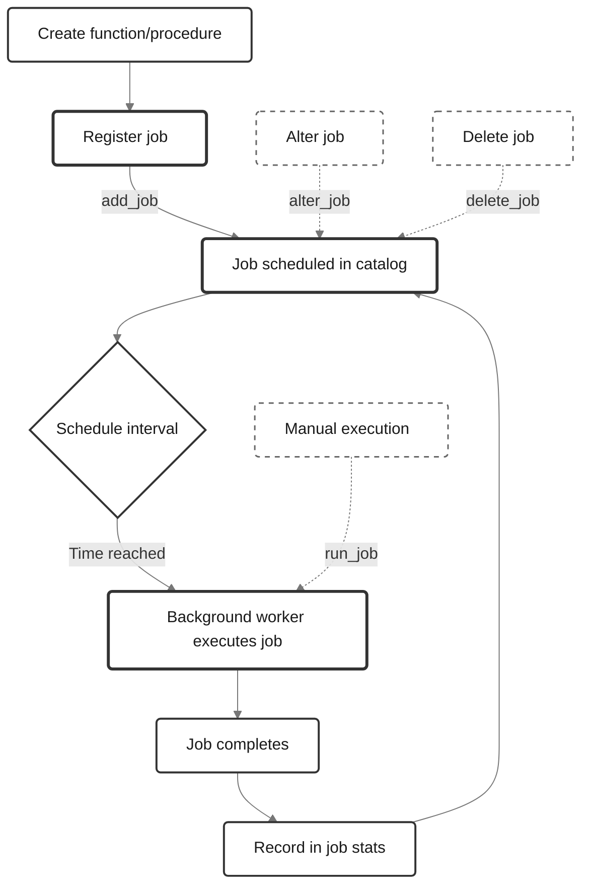

```mermaid
%%{init: {
  'theme':'base',
  'themeVariables': {
    'primaryColor':'#fff',
    'primaryTextColor':'#1a1a1a',
    'primaryBorderColor':'#333',
    'lineColor':'#666',
    'secondaryColor':'#fff',
    'secondaryTextColor':'#1a1a1a',
    'secondaryBorderColor':'#333',
    'tertiaryColor':'#fff',
    'tertiaryTextColor':'#1a1a1a',
    'tertiaryBorderColor':'#333',
    'noteBkgColor':'#fff',
    'noteTextColor':'#1a1a1a',
    'noteBorderColor':'#333',
    'background':'#fff',
    'mainBkg':'#fff',
    'fontFamily': "'Geist Mono', monospace",
    'edgeLabelBackground':'#fff',
    'labelColor':'#333',
    'labelTextColor':'#333'
  },
  'flowchart': { 'padding': 30, 'htmlLabels': true, 'curve': 'stepAfter' },

  /* Hover tint (best-effort; renderer may ignore themeCSS) */
  'themeCSS': `
    .node rect:hover,
    .node polygon:hover,
    .node path:hover {
      fill: rgba(244, 255, 97, 0.18) !important;
      transition: fill 120ms ease-in-out;
    }
  `
}}%%
graph TB
    A[Create function/procedure] --> B[Register job&nbsp;&nbsp;]
    B -->|add_job| C[Job scheduled in catalog]
    C --> D{Schedule interval}
    D -->|Time reached| E[Background worker executes job]
    E --> F[Job completes]
    F --> G[Record in job stats]
    G --> C

    I[Alter job&nbsp;&nbsp;] -.->|alter_job| C
    J[Delete job&nbsp;&nbsp;] -.->|delete_job| C
    H[Manual execution&nbsp;&nbsp;] -.->|run_job| E

    %% Border-only hierarchy
    %% - Primary nodes: thicker border (B, C, E)
    %% - Standard nodes: normal border (A, D, F, G)
    %% - Optional nodes: dashed + lighter border (H, I, J)

    style A fill:#fff,stroke:#333,stroke-width:2px,color:#1a1a1a,rx:4,ry:4

    style B fill:#fff,stroke:#333,stroke-width:3px,color:#1a1a1a,rx:4,ry:4
    style C fill:#fff,stroke:#333,stroke-width:3px,color:#1a1a1a,rx:4,ry:4
    style E fill:#fff,stroke:#333,stroke-width:3px,color:#1a1a1a,rx:4,ry:4

    style D fill:#fff,stroke:#333,stroke-width:2px,color:#1a1a1a
    style F fill:#fff,stroke:#333,stroke-width:2px,color:#1a1a1a,rx:4,ry:4
    style G fill:#fff,stroke:#333,stroke-width:2px,color:#1a1a1a,rx:4,ry:4

    style H fill:#fff,stroke:#666,stroke-width:1.5px,stroke-dasharray: 5 5,color:#1a1a1a,rx:4,ry:4
    style I fill:#fff,stroke:#666,stroke-width:1.5px,stroke-dasharray: 5 5,color:#1a1a1a,rx:4,ry:4
    style J fill:#fff,stroke:#666,stroke-width:1.5px,stroke-dasharray: 5 5,color:#1a1a1a,rx:4,ry:4

    %% connectors
    linkStyle default stroke:#777,stroke-width:1px

    click B "/api-reference/timescaledb/jobs-automation/add_job" "add_job API reference"
    click C "/api-reference/timescaledb/informational-views/index" "Learn about the catalog"
    click H "/api-reference/timescaledb/jobs-automation/run_job" "run_job API reference"
    click I "/api-reference/timescaledb/jobs-automation/alter_job" "alter_job API reference"
    click J "/api-reference/timescaledb/jobs-automation/delete_job" "delete_job API reference"
```
